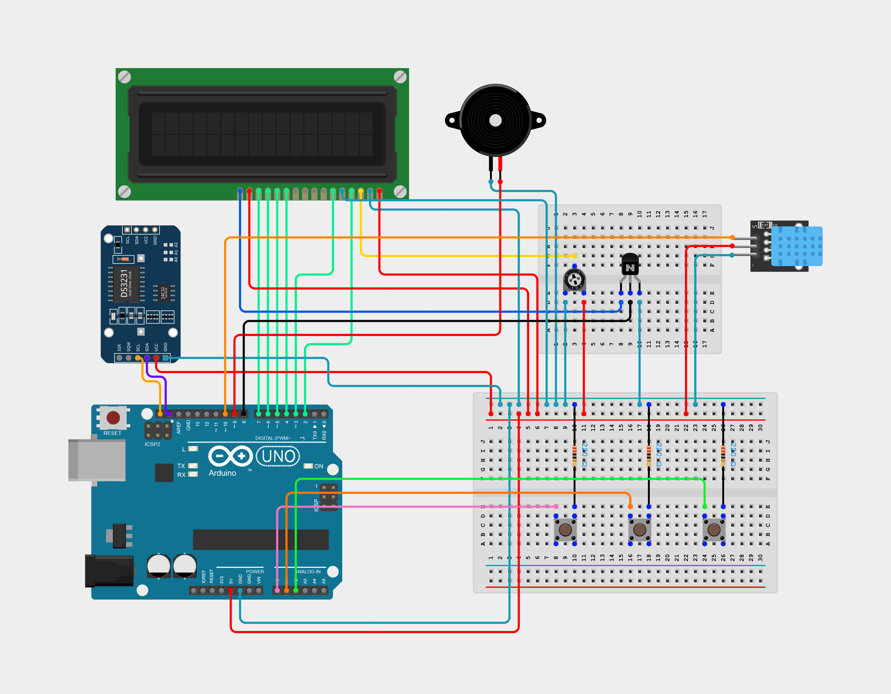

# Arduino-Alarm-Clock

## Circuit Diagram
Main components used
- Arduino Uno R3
- LCD Display (16 pin)
- KY-015 DHT11 (Temperature and Humidity)
- DS3231 RTC (Clock module)
- NPN Transistor (ECB)
- Piezo Speaker
- Trimmer Potentiometer
- Pushbutton and 220 Ohm Resistor

